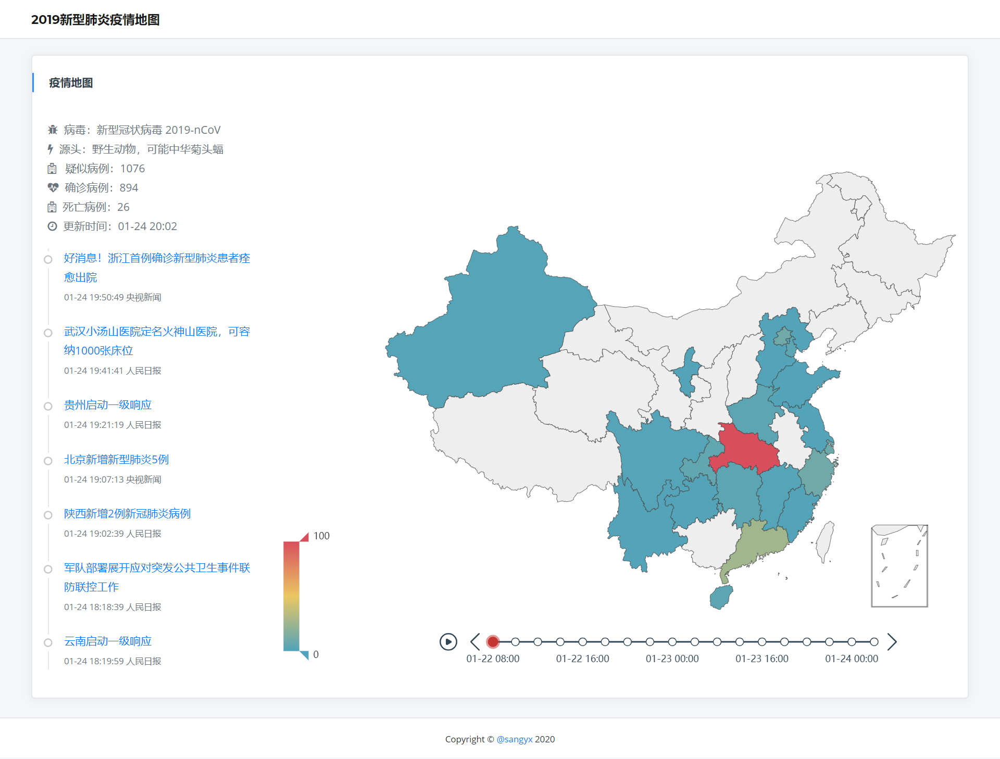

# nCoV-Map: 新型肺炎疫情地图

> 「弱小和无知不是生存的障碍，傲慢才是」——《三体》

本项目旨在为各种有利于抗击新型肺炎的应用提供简单框架。目前已实现简单的疫情演进地图(自2020年1月22日9点始)及资讯展示功能。应用示例如下：

本项目遵循MIT License，您可以以任何方式在此基础上扩展您的应用。以下为一些可供参考的idea：

* 弹幕显示最新资讯
* 微博舆情分析
* 春运交通流量
* 各地呼吸科医院展示
* 传播模拟
* 地图下钻

## 项目依赖
* python3
* flask
* pyecharts

## 数据来源
感谢[Isaac Lin](https://github.com/BlankerL)提供数据接口：<http://lab.isaaclin.cn/nCoV/>