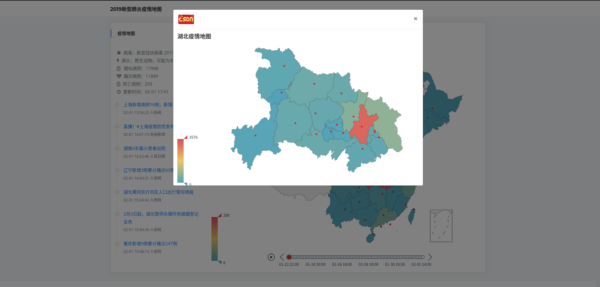

# nCoV-Map: 新型肺炎疫情地图

> 「弱小和无知不是生存的障碍，傲慢才是」——《三体》

**项目目前停止维护。如有需要可选择[OpenSourceWuhan 武汉开源](https://weileizeng.github.io/OpenSourceWuhan/)上的其他开源项目**

本项目旨在为各种有利于抗击新型肺炎的应用提供简单框架。目前已实现简单的疫情演进地图(自2020年1月22日22点始，因数据量过大加载太慢，目前只展示最近三天的数据)及资讯展示功能。

[示例网址](http://106.13.58.203:4000/)。页面展示：

  <h5>全国疫情</h5>
  
   
  <h5>地级市疫情</h5>
  
   

本项目遵循MIT License，您可以任何方式在此基础上扩展您的应用。以下为一些可供参考的idea：

* 微博舆情分析
* 春运交通流量
* 各地呼吸科医院展示
* 传播模拟
* 地图下钻
* 全网口罩比:价
* 捐赠信息汇总

## 项目依赖
* python3
* flask
* pyecharts
* pypinyin

## 数据来源
感谢[Isaac Lin](https://github.com/BlankerL)提供数据接口：<https://lab.isaaclin.cn/nCoV/>
